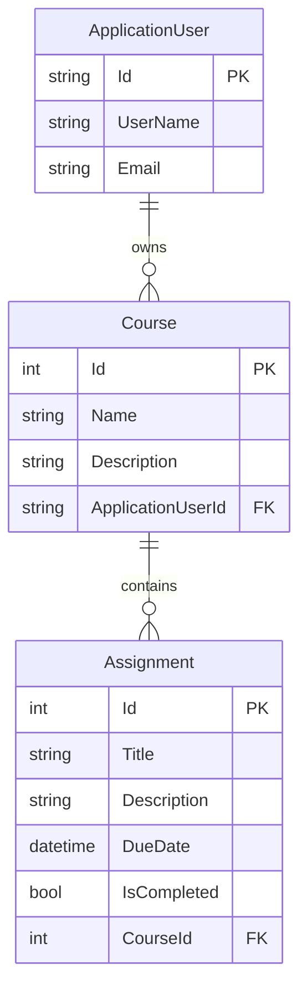

## Relationships

- One `ApplicationUser` can have many `Course` records.
- Each `Course` belongs to one `ApplicationUser`.
- One `Course` can have many `Assignment` records.
- Each `Assignment` belongs to one `Course`.

